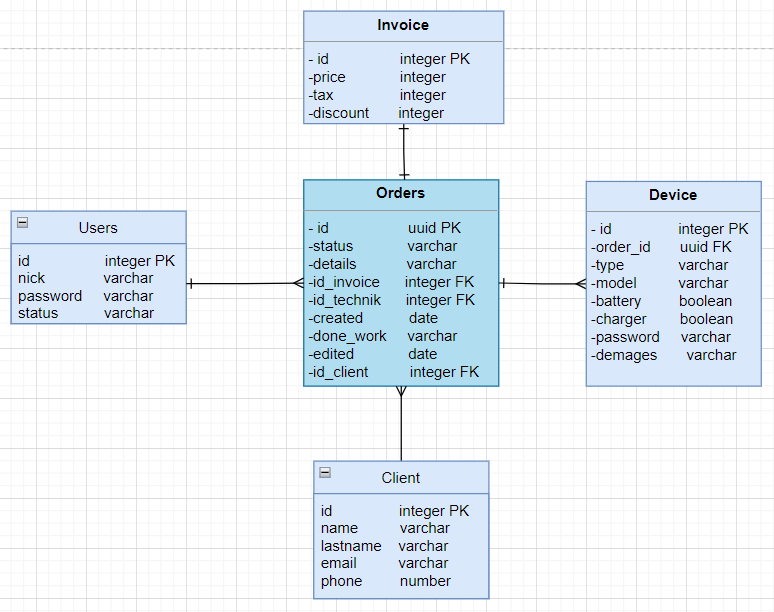

# request-service-system

REStFul API including full information about the order. System dedicated for appliance repair service(e.g. PCs, mouses,
keyboards or headphones). The system facilitates manage order for serves employees and tracking repair device progress
for client.

## Database structure

## Technologies

- Spring Boot
- Maven
- JUnit4
- Mockito
- JDBC
- Postgres
- Security
- Docker
- Docker-compose

## Endpoints

- `/client/`
#### Description:
Method allows ADMIN/TECHNICIAN to create a new client in the system.
It returns 1 if create was successful.

To post user data body of the request must contain JSON file with the given structure:

{

    "firstname" : "firstname",
    "lastname" : "lastname",
    "email" : "email",
    "phone" : 123456789

}
#### Request method:
POST
#### Authentication:
Require
#### Return value:
long
#### Errors:
BAD_REQUEST (400) - usually caused by an incorrect parameter.

UNAUTHORIZED (401) -valid authentication credentials for the requested resource.

FORBIDDEN (403) - missing or invalid  password or username.

- `/client/{id}`
#### Description:
This method takes one required parameter:
* clientId - id of client.
#### Request method:
GET
#### Authentication:
Require
#### Return value:
Object with client.
#### Errors:
BAD_REQUEST (400) - usually caused by invalid parameter.

UNAUTHORIZED (401) -valid authentication credentials for the requested resource.

FORBIDDEN (403) - missing or invalid  password or username.

NOT_FOUND (404) - client with given id does not exist in database.

- `/device/`
#### Description:
Method allows ADMIN/TECHNICIAN to create a new device in the system.
It returns 1 if create was successful.

To post user data body of the request must contain JSON file with the given structure:

{

    "device_type" : "device_type",
    "model" : "model",
    "damages" : "damages",
    "charger" : false
    "battery" : false
    "password" : 123456789
    "orderid" : 45f0383f-ab45-4a65-98f2-6dc5abb5c208

}
#### Request method:
POST
#### Authentication:
Require
#### Return value
long
#### Errors:
BAD_REQUEST (400) - usually caused by invalid parameter.

UNAUTHORIZED (401) -valid authentication credentials for the requested resource.

FORBIDDEN (403) - missing or invalid  password or username.
- `/device/{id}`
#### Description
This method takes one required parameter:
* deviceId - id of device.
#### Request method
GET
#### Authentication
Require
#### Return value
Object with device.
#### Errors
BAD_REQUEST (400) - usually caused by invalid parameter

UNAUTHORIZED (401) -valid authentication credentials for the requested resource.

FORBIDDEN (403) - missing or invalid  password or username

NOT_FOUND (404) - device with given id does not exist in database

- `/invoice/`
#### Description
Method allows ADMIN/TECHNICIAN to create a new client in the system.
It returns 1 if create was successful.

To post user data body of the request must contain JSON file with the given structure:

{

    "price" : 150,
    "tax" : 23,
    "discount" : 12.50

}
#### Request method
POST
#### Authentication
Require
#### Return value
long
#### Errors
BAD_REQUEST (400) - usually caused by invalid parameter

UNAUTHORIZED (401) -valid authentication credentials for the requested resource.

FORBIDDEN (403) - missing or invalid  password or username
- `/invoice/{id}`
#### Description
This method takes one required parameter:
* invoiceId - id of invoice.
#### Request method
GET
#### Authentication
Require.
#### Return value
Object with invoice.
#### Errors
BAD_REQUEST (400) - usually caused by invalid parameter.

UNAUTHORIZED (401) -valid authentication credentials for the requested resource.

FORBIDDEN (403) - missing or invalid  password or username.

NOT_FOUND (404) - invoice with given id does not exist in database.

- `/order/`
#### Description
Method allows users to create a new order in the system.
It returns 1 if create was successful.

To post user data body of the request must contain JSON file with the given structure:

{

    "firstname" : "firstname",
    "lastname" : "lastname",
    "email" : "email",
    "phone" : 123456789,
    "devices":
    {
        "id": 1,
        "device_type" : "device_type",
        "model" : "model",
        "damages" : "damages",
        "charger" : false
        "battery" : false
        "password" : 123456789
        "orderid" : 45f0383f-ab45-4a65-98f2-6dc5abb5c208
    },
    "details":"details"

}
#### Request method
POST
#### Authentication
Doesn't require.
#### Return value
long
#### Errors
BAD_REQUEST (400) - usually caused by invalid parameter.

UNAUTHORIZED (401) -valid authentication credentials for the requested resource.

FORBIDDEN (403) - missing or invalid  password or username.

- `/order/details/{id}`
#### Description
This method takes one required parameter:
* id - id of device.
#### Request method
GET
#### Authentication
Doesn't require.
#### Return value
Object with order details.
#### Errors
BAD_REQUEST (400) - usually caused by invalid parameter.

NOT_FOUND (404) - order with given id does not exist in database.

- `/order/doneWork/`
#### Description
This method takes dwo required parameter:
* orderId - id of order,
* doneWork - done work order.

It returns 1 if create was successful.
#### Request method
PUT
#### Authentication
Require.
#### Return value
long
#### Errors
BAD_REQUEST (400) - usually caused by invalid parameter.

UNAUTHORIZED (401) -valid authentication credentials for the requested resource.

FORBIDDEN (403) - missing or invalid  password or username.

NOT_FOUND (404) - order with given id does not exist in database.

- `/order/invoise/`
#### Description
This method takes dwo required parameter:
* orderId - id of order,
* invoiceId - id of invoice.

It returns 1 if create was successful.
#### Request method
PUT
#### Authentication
Require
#### Return value
long
#### Errors
BAD_REQUEST (400) - usually caused by invalid parameter.

UNAUTHORIZED (401) -valid authentication credentials for the requested resource.

FORBIDDEN (403) - missing or invalid  password or username.

NOT_FOUND (404) - invoice with given id does not exist in database.

- `/order/status/`
#### Description
This method takes dwo required parameter:
* orderId - id of order,
* status - status of order.

It returns 1 if create was successful.
#### Request method
PUT
#### Authentication
Require
#### Return value
long
#### Errors
BAD_REQUEST (400) - usually caused by invalid parameter.

UNAUTHORIZED (401) -valid authentication credentials for the requested resource.

FORBIDDEN (403) - missing or invalid  password or username.

NOT_FOUND (404) - order with given id does not exist in database.

- `/order/tehnician/`
#### Description
This method takes dwo required parameter:
* orderId - id of order,
* technicianId - id of technician.

It returns 1 if create was successful.
#### Request method
PUT
#### Authentication
Require
#### Return value
long
#### Errors
BAD_REQUEST (400) - usually caused by invalid parameter.

UNAUTHORIZED (401) -valid authentication credentials for the requested resource.

FORBIDDEN (403) - missing or invalid  password or username.

NOT_FOUND (404) - order with given id does not exist in database.

- `/order/{id}`
#### Description
This method takes one required parameter:
* id - id of order.
#### Request method
GET
#### Authentication
Require
#### Return value
Object with order.
#### Errors
BAD_REQUEST (400) - usually caused by invalid parameter.

UNAUTHORIZED (401) -valid authentication credentials for the requested resource.

FORBIDDEN (403) - missing or invalid  password or username.

NOT_FOUND (404) - order with given id does not exist in database.

- `/user/`
#### Description
Method allows ADMIN to create a new user in the system. 
It returns 1 if create was successful.

To post user data body of the request must contain JSON file with the given structure:

{

    "username" : "username",
    "password" : "password"

}
#### Request method
POST
#### Authentication
Require
#### Return value
long
#### Errors
BAD_REQUEST (400) - usually caused by invalid parameter.

UNAUTHORIZED (401) -valid authentication credentials for the requested resource.

FORBIDDEN (403) - missing or invalid  password or username.

- `/user/{id}`
#### Description
This method takes one required parameter:

id - id of user.
#### Request method
GET
#### Authentication
Require
#### Return value
Object with users.
#### Errors
BAD_REQUEST (400) - usually caused by invalid parameter.

UNAUTHORIZED (401) -valid authentication credentials for the requested resource.

FORBIDDEN (403) - missing or invalid  password or username.

NOT_FOUND (404) - user with given id does not exist in database.

## How to run

Using `docker-compose up` to run the container with the database. Next run server.